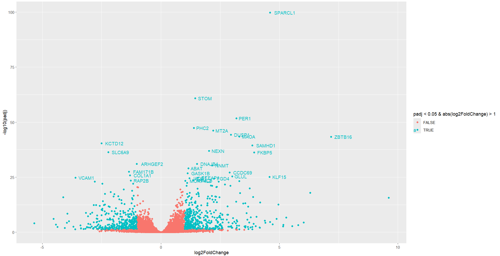
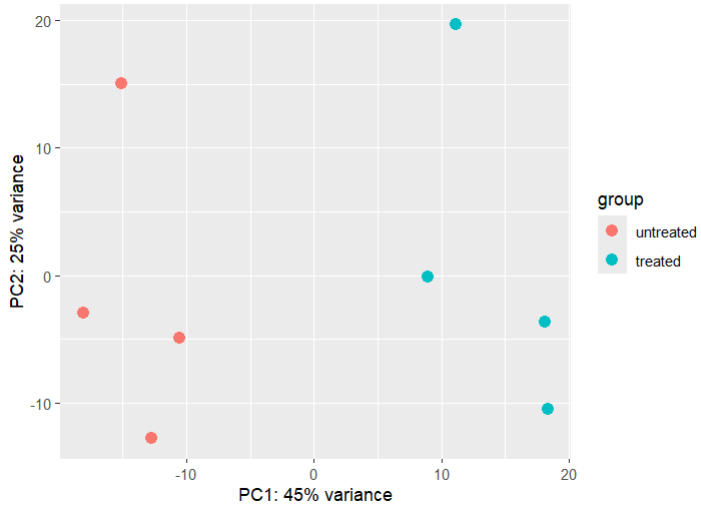
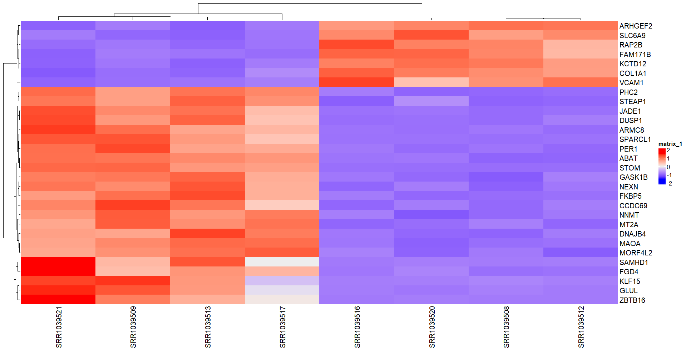
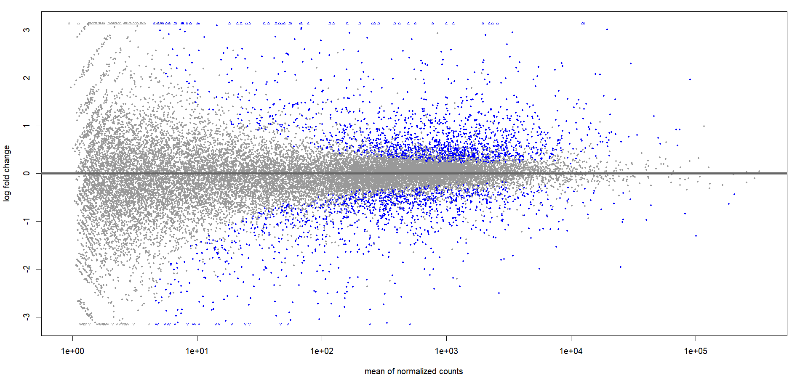
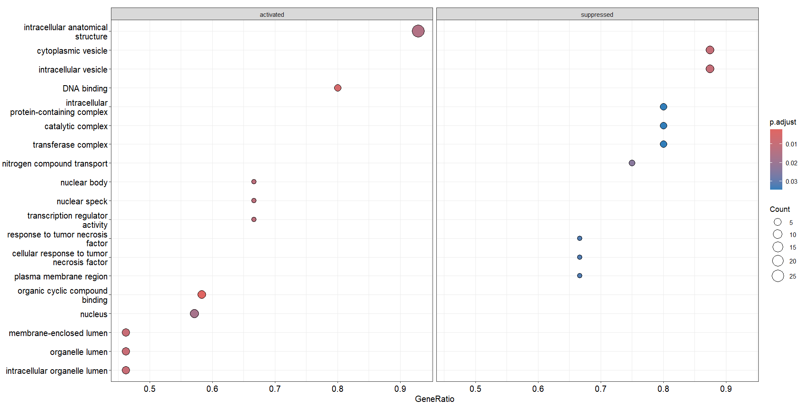
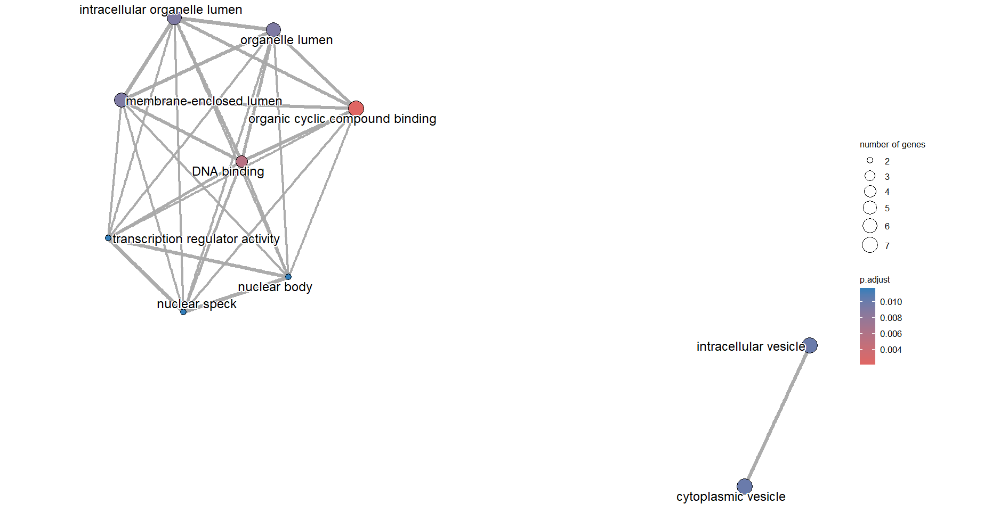
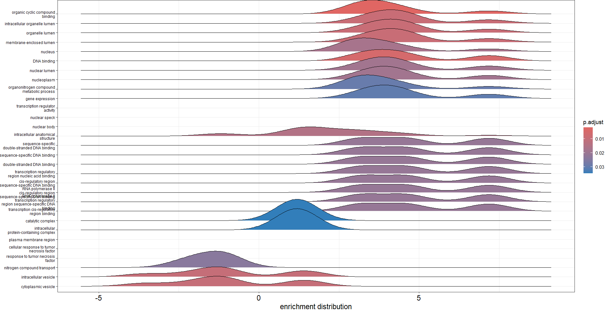
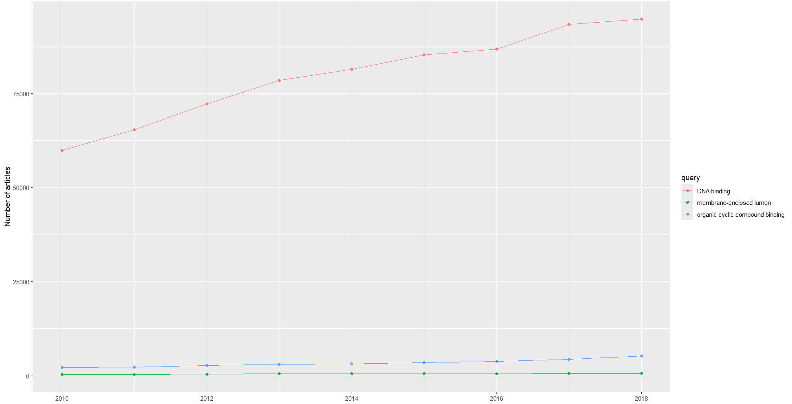

<table>
  <tr>
    <td><h1>RNA-Seq Transcriptome Profiling Analysis Project </h1></td>
    <td></td>
  </tr>
</table>

## Project Overview

In this project, I performed a comprehensive RNA-Seq transcriptome profiling analysis to investigate the effects of Dexamethasone treatment on various cell lines. The primary aim was to identify differentially expressed genes and gain insights into the gene expression changes induced by this glucocorticoid.

## Technical Details

### Software and Tools Used

- **R Programming Language**: The primary language used for data analysis and visualization.
- **Bioconductor Packages**: Essential for RNA-Seq data analysis.
- **DESeq2**: Used for differential expression analysis of count data.
- **clusterProfiler**: For Gene Set Enrichment Analysis (GSEA) and functional annotation.
- **enrichplot**: To visualize enrichment results.
- **ComplexHeatmap**: For creating heatmaps with hierarchical clustering.

### Data Processing

#### Data Import

- RNA-Seq count data was read from CSV files using `read.csv()`.
- Metadata containing sample information was also imported to match with the count data.

#### Data Transformation and Filtering

- Applied variance-stabilizing transformation (VST) to normalize the data using `vst()` function from DESeq2.
- Filtered out low-count reads to retain only those with sufficient expression levels.

### Differential Expression Analysis

- **DESeq2**: Used to perform differential expression analysis with the `DESeq()` function.
- **Result Extraction**: Results were extracted with an adjusted p-value cutoff of 0.05. Significant results were annotated with gene symbols using `org.Hs.eg.db` package.

### Visualization

- **Volcano Plot**: Generated to visualize the relationship between log fold changes and -log10 p-values of the genes. Significant genes were highlighted with fold change and adjusted p-value thresholds.
- **PCA Plot**: Principal Component Analysis (PCA) was performed to visualize sample clustering based on gene expression.
- **Heatmap**: Created to visualize the expression patterns of the top 30 differentially expressed genes across samples.
- **MA Plot**: Visualized the log fold changes against mean expression levels to identify genes with strong differential expression.

### Gene Set Enrichment Analysis (GSEA)

- Performed to identify biological processes and pathways significantly enriched in the gene expression data.
- Visualized results using dot plots, network plots, ridge plots, and GSEA plots.

### Additional Analysis

- **Pairwise Term Similarity**: Analyzed term similarity to explore relationships between different gene sets.
- **Publication Metrics Plot**: Examined trends and metrics related to top terms over a range of years.

## Summary

This project demonstrates a comprehensive approach to RNA-Seq data analysis, from raw count data processing and differential expression analysis to advanced functional enrichment and visualization techniques. By integrating various R packages and statistical methods, the analysis provided valuable insights into the impact of Dexamethasone on gene expression and identified key genes and pathways associated with the treatment.

## Graphical Results

### 1. Volcano Plot

- **Description**: This plot visualizes the relationship between log2 fold changes (x-axis) and -log10 adjusted p-values (y-axis) for all genes. The plot highlights significantly differentially expressed genes, with colors indicating significance based on adjusted p-values and fold changes.
- **Purpose**: To quickly identify genes with substantial changes in expression and statistical significance, helping to pinpoint key genes affected by Dexamethasone treatment.

### 2. PCA Plot

- **Description**: The Principal Component Analysis (PCA) plot displays the distribution of samples based on their gene expression profiles. Each point represents a sample, and the plot shows clustering patterns based on Dexamethasone treatment.
- **Purpose**: To visualize how samples group together based on gene expression, revealing any patterns or clusters that correspond to different treatment conditions.

### 3. Heatmap

- **Description**: This heatmap illustrates the expression levels of the top 30 differentially expressed genes across different samples. Rows represent genes, and columns represent samples, with hierarchical clustering applied to both.
- **Purpose**: To provide a clear view of gene expression patterns and identify clusters of genes and samples with similar expression profiles, highlighting the effect of Dexamethasone on gene expression.

### 4. MA Plot

- **Description**: The MA plot shows the relationship between mean expression levels and log2 fold changes. Each point represents a gene, with the x-axis indicating average expression and the y-axis indicating the fold change.
- **Purpose**: To examine how gene expression changes with respect to the mean expression levels, helping to identify genes with strong differential expression.

### 5. Gene Set Enrichment Analysis (GSEA) Dot Plot

- **Description**: The dot plot visualizes the enrichment of different gene sets. Each dot represents a gene set, with the size and color of the dot indicating significance and the degree of enrichment.
- **Purpose**: To identify which gene sets or pathways are significantly enriched in the differentially expressed genes, providing insights into the biological processes affected by Dexamethasone.

### 6. Gene Set Enrichment Analysis (GSEA) Network Plot

- **Description**: This network plot illustrates the relationships between enriched gene sets. Nodes represent gene sets, and edges show similarities between them based on enrichment results.
- **Purpose**: To explore and visualize the connections between different gene sets and pathways, facilitating the understanding of their functional relationships.

### 7. Gene Set Enrichment Analysis (GSEA) Ridge Plot

- **Description**: The ridge plot displays the distribution of enrichment scores across different gene sets. Each ridge represents a gene set, showing how enrichment scores are distributed.
- **Purpose**: To visualize the distribution of enrichment scores for gene sets, highlighting the variability and significance of different gene sets.

### 8. Publication Metrics Plot

- **Description**: The publication metrics plot displays trends and metrics related to the top gene sets over a range of years.
- **Purpose**: To analyze the historical trends and relevance of the top gene sets in the scientific literature, providing context for their importance.
